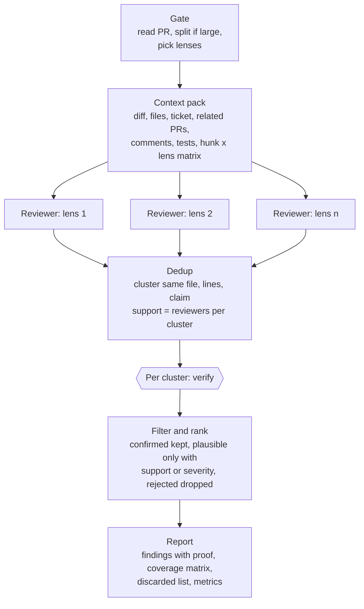
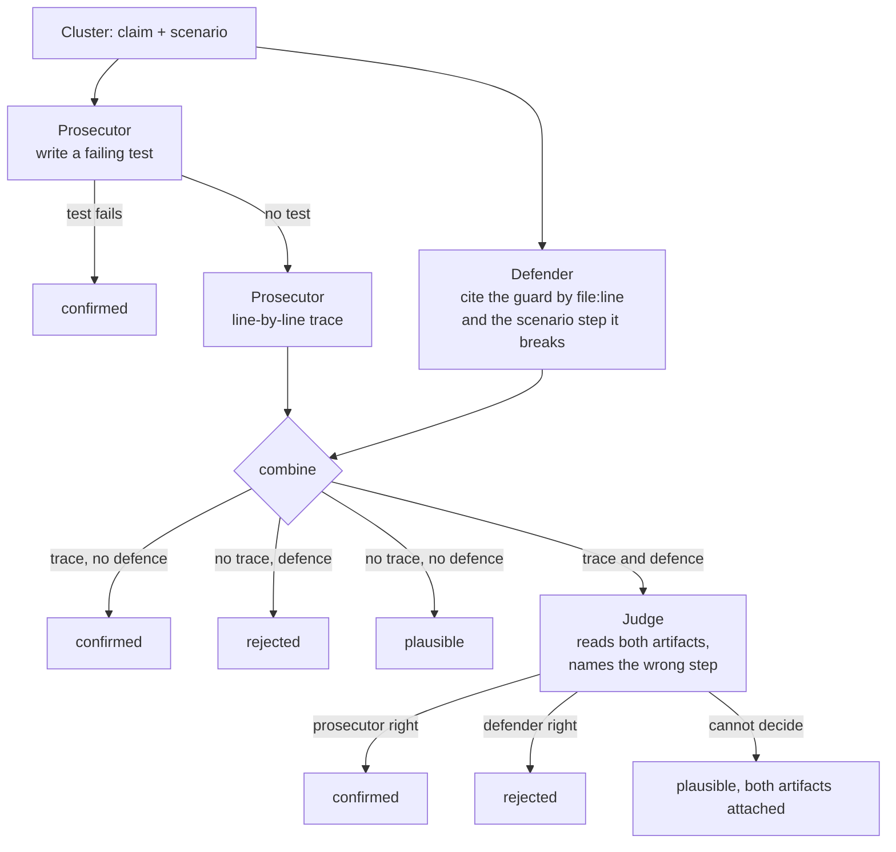

# review-ensemble

A Claude Code skill that reviews a pull request the way a search algorithm
would: many independent samples, forced diversity, a vote, and a verifier
that has to prove each claim before it reaches you.

## Why

One AI review is one sample from a random distribution. Run it again and
it finds different things. A human reviewer later finds something it
missed, and the temptation is to blame "lack of context". Usually the
context was there; the sample just did not land on it.

The fix is not a better single review. It is treating a review as a
sampling problem: take several samples, make them look at different
things, count how often the same claim comes back, and let something
deterministic decide what is real.

## Logic flow

The orchestrator never reviews code. It only builds structure around
agents that do.



1. **Gate.** Read the PR. Split it if it is large or mixes concerns. Choose
   lenses: seven that always run, plus conditional ones triggered by what
   the diff touches.
2. **Context pack.** Build one read-only folder every reviewer sees: the
   diff, the changed files in full, the ticket's acceptance criteria, related
   PRs and their comments, existing review threads, the tests that touch
   the change, and a matrix of every diff hunk crossed with every lens.
3. **Fan-out.** One fresh agent per lens. Each hunts a single bug class and
   owns specific cells of the matrix. It reports findings in a fixed shape,
   and also reports "looked, found nothing" per cell, so silence is never
   mistaken for coverage.
4. **Dedup.** Cluster findings that point at the same lines and say the same
   thing. How many reviewers landed on a cluster is its support.
5. **Verify.** Per cluster, an adversarial trio that never sees the support
   count. Detailed below.
6. **Filter and rank.** Keep what was confirmed. Keep the undecided only
   when several reviewers agreed or the severity is high. Drop the rest.
7. **Report.** Findings with their proof, a coverage matrix showing what
   was and was not looked at, a one-line list of everything discarded so a
   human can spot-check the filter, and per-lens metrics. Nothing is posted
   to the PR.

### Adversarial verification

Each unique claim goes through a prosecutor and a defender who do not see
each other, and a judge only when they conflict. None of them sees how
many reviewers raised the claim.



The prosecutor tries a failing test first. A failing test is deterministic,
so it ends the argument on its own. Failing that, it produces a concrete
trace: inputs, order of events, wrong outcome. The defender works in
parallel and must point at the exact guard, invariant or ordering that
makes the scenario impossible. When both produce an artifact, the judge
reads the two and must name the step where one is wrong; it adds no
argument of its own. Every verdict carries its artifacts into the report.

Two invariants hold everything up. Reviewers never see each other, so the
vote is real. Verifiers never see how many reviewers agreed, so they
cannot anchor.

## Lenses

A lens is a job description for one reviewer. Universal lenses cover
specification, control and error paths, state transitions, callers and
siblings, tests as specification, diff hygiene, and prior review comments.
Conditional lenses cover concurrency, data shape, UI contracts, HTTP
boundaries, config and deploy, performance, and security. See
[lenses.md](lenses.md).

The skill itself contains no repository-specific knowledge. A repository
adds a profile at `.claude/review/profile.yaml` with its test command,
extra context sources, and its own conditional lenses with path and diff
triggers. See [examples/profile.yaml](examples/profile.yaml). Without a
profile, generic triggers apply and the run ends with a suggested profile.

## Install

```bash
git clone https://github.com/gowikel/review-ensemble ~/.claude/skills/review-ensemble
```

Any directory Claude Code reads skills from works; the folder name is the
skill name.

## Run

```
/review-ensemble
/review-ensemble 1234
/review-ensemble 1234 lenses=concurrency,tests-as-spec N=2
```

No number: the PR is detected from the current branch. Explicit lenses
replace the automatic selection. `N` is reviewers per lens, default 1.

Expect ten to twenty agents on a typical PR. This is the heavy pass, not
the everyday one.

## License

[WTFPL](LICENSE).
