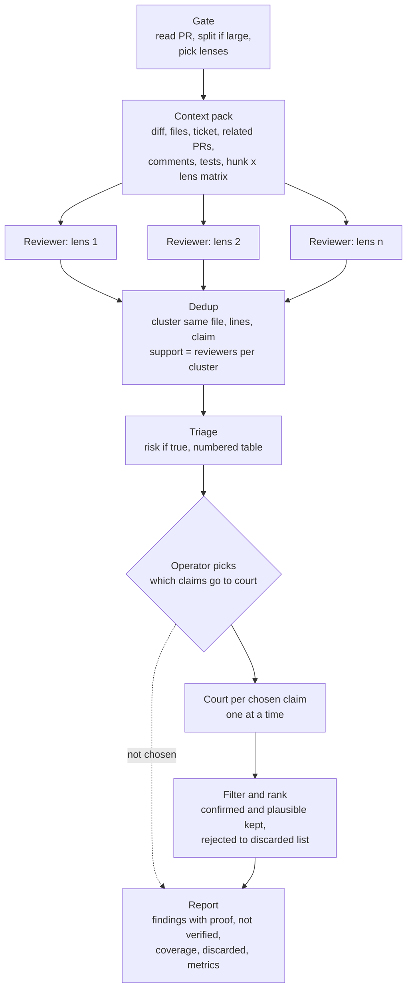
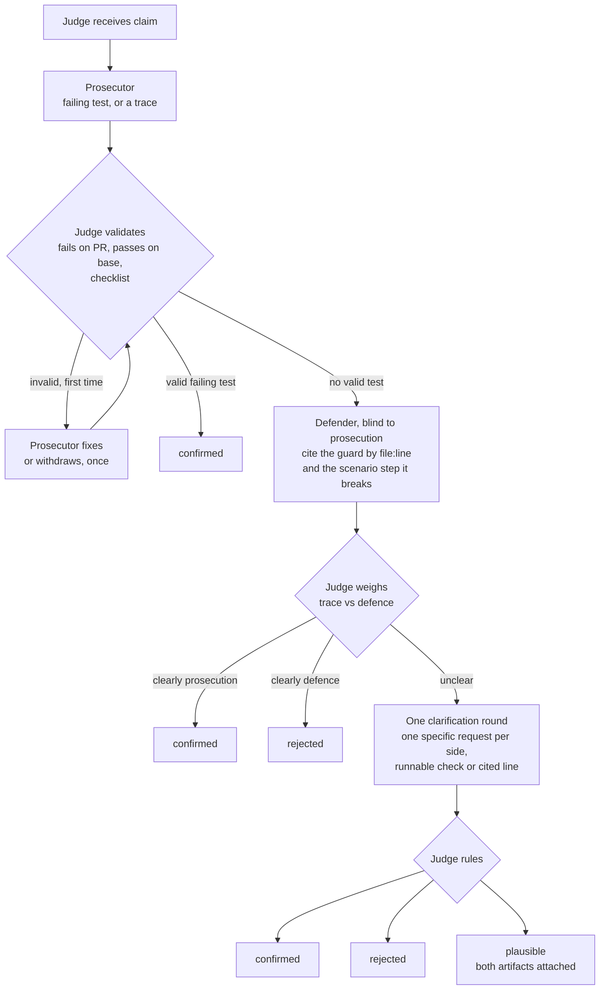

# review-ensemble

A Claude Code skill that reviews a pull request the way a search algorithm
would: many independent samples, forced diversity, a vote, and a verifier
that has to prove each claim before it reaches you.

## Why

One AI review is one sample from a random distribution. Run it again and
it finds different things. A human reviewer later finds something it
missed, and the temptation is to blame "lack of context". Usually the
context was there; the sample just did not land on it.

The fix is not a better single review. It is treating a review as a
sampling problem: take several samples, make them look at different
things, count how often the same claim comes back, and let something
deterministic decide what is real.

## Logic flow

The orchestrator never reviews code. It only builds structure around
agents that do.



1. **Gate.** Read the PR. Split it if it is large or mixes concerns. Choose
   lenses: seven that always run, plus conditional ones triggered by what
   the diff touches.
2. **Context pack.** Build one read-only folder every reviewer sees: the
   diff, the changed files in full, the ticket's acceptance criteria, related
   PRs and their comments, existing review threads, the tests that touch
   the change, and a matrix of every diff hunk crossed with every lens.
3. **Fan-out.** One fresh agent per lens, run one after another by default.
   Each hunts a single bug class and owns specific cells of the matrix. It
   reports findings in a fixed shape, and also reports "looked, found
   nothing" per cell, so silence is never mistaken for coverage.
4. **Dedup.** Cluster findings that point at the same lines and say the same
   thing. How many reviewers landed on a cluster is its support.
5. **Triage and stop.** A separate agent rates each claim by how much damage
   it would do if true. It does not check whether it is true. The claims are
   printed as a numbered table, highest risk first, and the run stops until
   the operator says which numbers go to court (`1-8`, `1,3,7`, `all`,
   `none`). Claims the operator already knows about, or cannot act on right
   now, cost nothing further.
6. **Court.** Each chosen claim is tried one at a time by a judge who runs
   a prosecutor, a defender and the rules below.
7. **Filter and rank.** Confirmed and plausible claims are kept and marked.
   Rejected ones move to the discarded list.
8. **Report.** Findings with their proof, the claims that were not verified
   and why, a coverage matrix showing what was and was not looked at, a
   one-line list of everything rejected with the deciding step, and per-lens
   metrics. Nothing is posted to the PR.

### The court

The orchestrator creates a judge per claim. The judge gets the claim, the
scenario, the files, the tests and a worktree. It never learns how many
reviewers raised the claim. The judge summons the other roles, validates
what they produce, and rules; it never argues a side itself.



A red test is not evidence by itself. `assert 1 == 2` is red. The judge
first runs it mechanically: it must fail on the PR branch and pass on the
base branch, otherwise it is pre-existing or broken. Then a five-item
checklist: the assertion names the wrong outcome from the claim, the
failure is on that assertion and not on setup, the unit under test is real
and only collaborators are mocked, the inputs match the scenario, and the
test would pass once the defect is fixed. Any miss goes back to the
prosecutor once, with the failed item named. A second miss counts as no
test.

A valid failing test settles the claim alone; no defender runs. Otherwise
the defender works blind to the prosecution and must point at the exact
guard, invariant or ordering that makes the scenario impossible. The judge
then weighs the two artifacts. When neither clearly wins there is a single
clarification round, one specific request per side, asking for a runnable
check or a cited line for one named step, never for more prose. After that
the judge rules confirmed, rejected or plausible. Plausible is a real
outcome: the operator gets both artifacts and decides.

Invariants. Reviewers never see each other, so the vote is real. Nobody in
the court sees how many reviewers agreed, so they cannot anchor. The
defender never sees the prosecution, so its guard is an independent sample.

## Lenses

A lens is a job description for one reviewer. Universal lenses cover
specification, control and error paths, state transitions, callers and
siblings, tests as specification, diff hygiene, and prior review comments.
Conditional lenses cover concurrency, data shape, UI contracts, HTTP
boundaries, config and deploy, performance, and security. See
[lenses.md](lenses.md).

The skill itself contains no repository-specific knowledge. A repository
adds a profile at `.claude/review/profile.yaml` with its test command,
extra context sources, and its own conditional lenses with path and diff
triggers. See [examples/profile.yaml](examples/profile.yaml). Without a
profile, generic triggers apply and the run ends with a suggested profile.

## Install

```bash
git clone https://github.com/gowikel/review-ensemble ~/.claude/skills/review-ensemble
```

Any directory Claude Code reads skills from works; the folder name is the
skill name.

## Run

```
/review-ensemble
/review-ensemble 1234
/review-ensemble 1234 lenses=concurrency,tests-as-spec N=2
```

### Parameters

| Parameter | Default | Meaning |
|---|---|---|
| PR number | current branch's PR | Which pull request to review. |
| `lenses=` | automatic | Comma-separated lens names. Replaces the gate's selection entirely. |
| `N=` | `1` | Reviewers per lens. Each is a fresh, independent agent. |
| `parallel=` | `1` | Agents running at once. Sequential by default so token usage per minute stays flat. |
| `tier=high` | off | Judge and deep reviewers use the strongest model available. Costly; off unless asked. |

`N=1` gives one sample per lens; agreement is then measured across lenses
only. Raise it (`N=2`, `N=3`) on high-risk PRs: the same lens sampled
several times makes support counts meaningful within a lens too, and a
claim found by three of three concurrency reviewers is a stronger signal
than one found by one. Cost grows linearly with `N`.

### Models

Roles name a tier, not a model, so the skill reads the same in any agent
runtime. `standard` reads and tallies: the orchestrator, the shallow lenses
(spec, diff hygiene, prior review) and triage. `strong` traces code, writes
tests and weighs evidence: the deep lenses, prosecutor, defender and judge.
`max` is the strongest model available and is used only with `tier=high`,
for the judge and the deep lenses.

One table in `SKILL.md` maps each tier to a model name per runtime. A
runtime that cannot pick a model per subagent runs every role at the
session's model and says so in the metrics. A repository profile can
override a tier with a vendor name.

Expect ten to twenty reviewer agents on a typical PR plus two to five per
claim sent to court. This is the heavy pass, not
the everyday one.

## License

[WTFPL](LICENSE).
